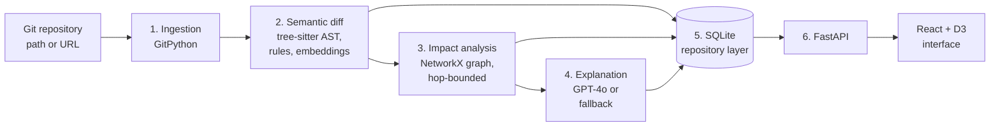

# SemantiX

**AI-augmented visual analytics for semantic software evolution and dependency impact analysis.**


SemantiX reads a Git history and answers three questions about every commit: **what kind of change was it**, **which parts of the system does it reach**, and **how risky is it**. Instead of a list of added and removed lines, you get a classified change, a bounded dependency-impact subgraph, a structured explanation, and interactive views to explore all of it.

---

## Table of Contents

1. [Features](#features)
2. [How It Works](#how-it-works)
3. [Change Categories and Risk Levels](#change-categories-and-risk-levels)
4. [Tech Stack](#tech-stack)
5. [Project Structure](#project-structure)
6. [Getting Started](#getting-started)
7. [Configuration](#configuration)
8. [Usage](#usage)
9. [API Reference](#api-reference)
10. [Visual Interface](#visual-interface)
11. [Testing](#testing)
12. [Known Limitations](#known-limitations)
13. [Roadmap](#roadmap)
14. [Author](#author)
15. [License](#license)

---

## Features

- **Semantic change classification.** Each changed file is labelled as a rename, formatting change, refactor, logic change, API change or bug-fix pattern, with a confidence value.
- **Structural AST diffing.** Python and JavaScript files are parsed with tree-sitter and compared node by node.
- **Embedding similarity.** Old and new file versions are compared with `text-embedding-3-large` (cosine similarity), with hash-based caching.
- **Dependency impact analysis.** A NetworkX graph of files, functions, classes, imports and calls yields direct and transitive impacts within a configurable hop limit.
- **Structured explanations.** GPT-4o returns a schema-constrained JSON explanation with a risk level. Malformed output triggers one stricter retry and then a deterministic fallback.
- **Works offline.** Without Azure OpenAI credentials, the pipeline runs end to end using deterministic fallbacks.
- **Interactive front end.** A commit timeline, a force-directed impact graph and a hotspot treemap, linked by a shared selection.
- **Job-based REST API.** Analyses run as background jobs; results are read through simple endpoints.

---

## How It Works



| Stage | Module | What it does |
| --- | --- | --- |
| 1. Ingestion | `semantix/ingestion` | Walks the commit history, compares each commit with its first parent and reads both versions of every changed file. |
| 2. Semantic diff | `semantix/semantic_diff` | Parses files with tree-sitter, counts AST insertions, deletions and updates, applies an ordered rule set to assign a change category, and computes embedding similarity. |
| 3. Impact analysis | `semantix/dependency_graph` | Builds a dependency graph and expands from the changed node up to `hop_limit` hops, separating direct from transitive impacts. |
| 4. Explanation | `semantix/explanation` | Prompts GPT-4o with the evidence above and validates the JSON reply, or falls back to a rule-based explanation and risk level. |
| 5. Storage | `semantix/storage` | Persists everything in SQLite behind a repository class. |
| 6. API | `semantix/api` | Exposes the pipeline as background jobs and read endpoints. |

---

## Change Categories and Risk Levels

The classifier applies the following rules in order; the first match wins. Confidence values are fixed rule priors, not calibrated probabilities.

| Order | Condition | Category | Confidence |
| --- | --- | --- | --- |
| 1 | Git reports a rename | `rename` | 0.95 |
| 2 | File added or deleted | `logic_change` | 0.85 |
| 3 | Identical text after removing whitespace | `formatting/cosmetic` | 0.95 |
| 4 | No AST node changed | `formatting/cosmetic` | 0.90 |
| 5 | Added lines contain a defensive-code pattern (null check, try/except, raise, throw, return None/null) | `bug_fix_pattern` | 0.85 |
| 6 | Added lines contain a declaration pattern (def, class, function, export) | `api_change` | 0.90 / 0.85 |
| 7 | Only updated AST nodes | `refactor` | 0.80 |
| 8 | Any other AST edit | `logic_change` | 0.80 |
| 9 | No signal (for example, an unsupported file type) | `unknown` | 0.50 |

When no model is available, the fallback risk level is derived from the category and the number of affected nodes:

| Condition | Risk |
| --- | --- |
| `api_change` or `logic_change`, and more than 5 affected nodes | `critical` |
| `api_change` or `logic_change`, or more than 2 affected nodes | `high` |
| `refactor` or `bug_fix_pattern` | `medium` |
| Otherwise | `low` |

**Hotspots** rank files by *semantic churn*: the number of change records labelled `logic_change` or `api_change`.

---

## Tech Stack

| Layer | Technology |
| --- | --- |
| Language and API | Python 3.11 / 3.12, FastAPI, Uvicorn, Pydantic |
| Parsing | tree-sitter (`tree-sitter-python`, `tree-sitter-javascript`) |
| Graph analysis | NetworkX |
| AI | Azure OpenAI: GPT-4o (explanations), `text-embedding-3-large` (embeddings) |
| Git access | GitPython |
| Persistence | SQLite with a repository (data access) layer |
| Front end | React 19, TypeScript, Vite, Tailwind CSS, D3, TanStack Query |
| Testing | pytest, httpx |

---

## Project Structure

```text
SemantiX/
├── semantix/
│   ├── models.py                 # Pydantic domain models
│   ├── ingestion/                # Git history walking and file content extraction
│   ├── semantic_diff/            # Parser, AST diff, rule classifier, embedding similarity
│   ├── dependency_graph/         # Graph construction and impact propagation
│   ├── explanation/              # LLM explainer with validation, retry and fallback
│   ├── storage/                  # SQLite connection and repository layer
│   └── api/                      # FastAPI app and background pipeline runner
├── frontend/
│   └── src/
│       ├── api/                  # Typed API client
│       ├── components/
│       │   ├── analytics/        # Risk summary header
│       │   ├── layout/           # Application shell
│       │   └── views/            # Repo input, timeline, dependency graph, hotspots
│       └── context/              # Shared selection state
├── tests/                        # pytest suite
├── .env.example                  # Back-end configuration template
├── pytest.ini
├── requirements.txt
└── README.md
```

---

## Getting Started

### Prerequisites

- Python 3.11 or newer
- A recent LTS release of Node.js (20 or newer) and npm
- Git
- *(Optional)* An Azure OpenAI resource with a chat deployment (GPT-4o) and an embedding deployment (`text-embedding-3-large`)

### 1. Clone the repository

```bash
git clone https://github.com/AnusreeThanapal/SemantiX.git
cd SemantiX
```

### 2. Back end

```bash
python -m venv .venv
source .venv/bin/activate          # Windows: .venv\Scripts\activate
pip install -r requirements.txt

cp .env.example .env               # then edit .env (see Configuration)

uvicorn semantix.api.app:app --reload --host 0.0.0.0 --port 8000
```

The API is now available at `http://localhost:8000`, with interactive documentation at `http://localhost:8000/docs`.

### 3. Front end

```bash
cd frontend
cp .env.example .env               # defaults to http://localhost:8000
npm install
npm run dev                        # http://localhost:5173
```

To create a production build, run `npm run build`.

---

## Configuration

### Back end (`.env`)

| Variable | Purpose | Default |
| --- | --- | --- |
| `AZURE_OPENAI_ENDPOINT` | Azure OpenAI endpoint for the chat model | none |
| `AZURE_OPENAI_KEY` | API key for the chat model | none |
| `AZURE_OPENAI_DEPLOYMENT` | Chat deployment name | `gpt-4o` |
| `AZURE_OPENAI_API_VERSION` | API version | `2024-02-01` |
| `AZURE_OPENAI_EMBEDDING_ENDPOINT` | Endpoint for the embedding model (falls back to the chat endpoint) | none |
| `AZURE_OPENAI_EMBEDDING_KEY` | Key for the embedding model (falls back to the chat key) | none |
| `AZURE_OPENAI_EMBEDDING_DEPLOYMENT` | Embedding deployment name | `text-embedding-3-large` |
| `SEMANTIX_DB_PATH` | Path to the SQLite database | `semantix.db` |
| `SEMANTIX_CORS_ORIGINS` | Comma-separated list of allowed browser origins | `http://localhost:5173,http://127.0.0.1:5173` |

### Front end (`frontend/.env`)

| Variable | Purpose | Default |
| --- | --- | --- |
| `VITE_API_BASE_URL` | Base URL of the SemantiX API | `http://localhost:8000` |

### Offline mode

If Azure OpenAI credentials are not set, or a call fails, SemantiX does not stop. Embeddings are replaced by a deterministic character-frequency vector and explanations by a rule-based template with the risk levels shown above. This keeps the pipeline usable in tests and demonstrations, but similarity scores and explanations produced offline are **not comparable** with model-generated ones.

> **Security.** Never commit `.env` files. Both `.env` and the local database `semantix.db` are already listed in `.gitignore`.

---

## Usage

### From the interface

1. Open `http://localhost:5173`.
2. Enter a local repository path or a Git URL and a commit depth, then start the analysis.
3. When the job completes, the timeline opens automatically. Select a commit to read its explanation, then switch to the dependency view or the hotspot view.

### From the command line

```bash
# 1. Start an analysis
curl -X POST http://localhost:8000/repos/analyze \
  -H "Content-Type: application/json" \
  -d '{"repo_url_or_path": "./", "commit_depth": 100, "hop_limit": 3}'

# 2. Poll the job (use the job_id from step 1)
curl http://localhost:8000/jobs/<job_id>

# 3. Explore results
curl "http://localhost:8000/commits?limit=20"
curl http://localhost:8000/commits/<sha>/impact
curl http://localhost:8000/commits/<sha>/explanation
curl "http://localhost:8000/hotspots?limit=10"
```

---

## API Reference

| Method | Endpoint | Description |
| --- | --- | --- |
| `GET` | `/` | Service name and version. |
| `POST` | `/repos/analyze` | Starts an analysis job. Returns `202 Accepted` with a `job_id`. |
| `GET` | `/jobs/{job_id}` | Returns job status: `pending`, `running`, `complete` or `failed`. |
| `GET` | `/commits` | Paginated commit summaries (sha, author, timestamp, message, change type, risk level). Query: `limit` (1–500), `offset`. |
| `GET` | `/commits/{sha}/impact` | Impact subgraph(s) for a commit. Optional `file_path` filter. |
| `GET` | `/commits/{sha}/explanation` | Explanation(s) for a commit. Optional `file_path` filter. |
| `GET` | `/hotspots` | Files ranked by semantic churn. Query: `limit` (1–100). |

**`POST /repos/analyze` request**

| Field | Type | Default | Constraint |
| --- | --- | --- | --- |
| `repo_url_or_path` | string | required | Local directory or Git clone URL |
| `commit_depth` | integer | 100 | 1–1000 |
| `hop_limit` | integer | 3 | 1–10 |

**Example responses**

```json
{ "job_id": "3f8b0306-613d-4f10-9b34-8c87e02df352", "status": "pending" }
```

```json
{
  "commit_sha": "…",
  "summary": "…",
  "why_it_matters": "…",
  "affected_count": 4,
  "risk_level": "high"
}
```

When a commit contains several analysed files, the impact and explanation endpoints return a list; use the `file_path` query parameter to select one.

---

## Visual Interface

| View | Purpose | Encoding |
| --- | --- | --- |
| **Risk summary** | Overview of risk across the analysed history | Donut chart of risk levels, high-risk share, top hotspot |
| **Timeline** | Locate and select commits | Time on the horizontal axis; colour = change category; filters for author, category and text |
| **Dependency graph** | See what a change reaches | Force-directed layout centred on the changed node; distance from the centre follows hop distance; colour = direct or transitive; dashed edges = transitive; pan, zoom, search, click to focus |
| **Row view** | List impacted nodes | One row per node, marked as direct or transitive |
| **Hotspot treemap** | Compare modules | Area and colour (teal to amber) = semantic churn count |

---

## Testing

```bash
pytest -v
```

The suite covers ingestion, semantic diffing, the dependency graph, the explanation layer, storage and the API. No Azure OpenAI credentials are needed; tests use the offline fallbacks.

---

## Known Limitations

SemantiX is a research prototype. The following behaviours are worth knowing before relying on its output:

- **Simplified AST matching.** Node matching is greedy (exact label first, then node type) and does not detect moved code. It is inspired by GumTree but is not a full implementation.
- **Rule-based categories.** Rules are ordered and use line-level patterns; confidence values are hand-set constants.
- **Static, name-based dependency graph.** The graph is built once from the latest file contents seen during ingestion, resolves calls by name only, and traverses edges in both directions. Only Python and JavaScript are supported.
- **Unsupported file types** (for example CSS, JSON, HTML) are labelled `unknown`.
- **Re-analysis appends data.** Running the same analysis again inserts additional change records, because the `changed_files` and `change_records` tables have no uniqueness constraint. Counts and hotspot scores can therefore be inflated by repeated runs; use a fresh database (`SEMANTIX_DB_PATH`) for clean results.
- **Embedding input** is truncated to the first 8,000 characters of each file.

---

## Roadmap

- [ ] Uniqueness constraints (or replace-on-rerun) for change records
- [ ] Full GumTree-style matching with move detection
- [ ] Per-commit dependency snapshots and directed impact analysis
- [ ] Commit-level aggregation of file-level changes
- [ ] Support for additional languages
- [ ] Timeline layout that handles closely spaced commits
- [ ] Colour-vision-friendly palettes and consistent colour semantics across views
- [ ] Evaluation on annotated open-source repositories and a user study

---

## Author

**Anusree T**
M.Tech Integrated Computer Science and Engineering (Business Analytics), Vellore Institute of Technology, Chennai

Issues and suggestions are welcome through the [GitHub issue tracker](https://github.com/AnusreeThanapal/SemantiX/issues).

---

## License

No license has been specified for this repository yet. Until one is added, all rights are reserved by the author.
